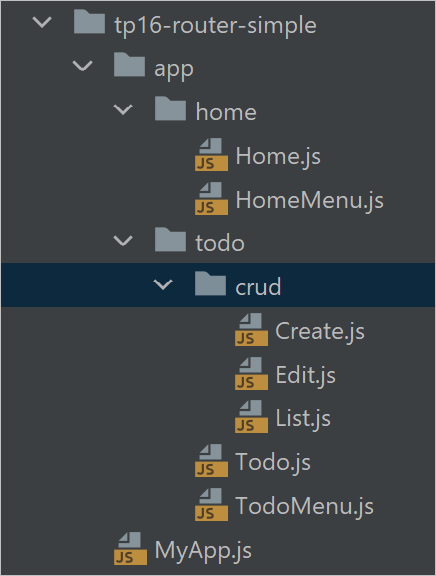
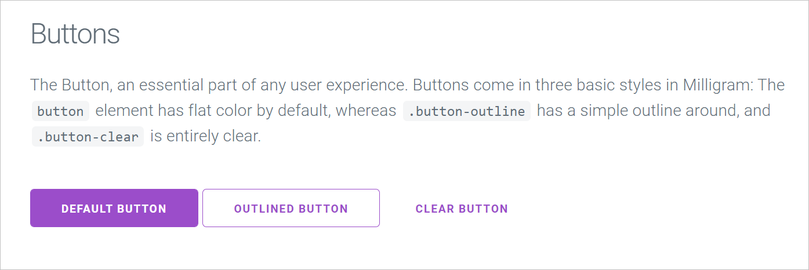
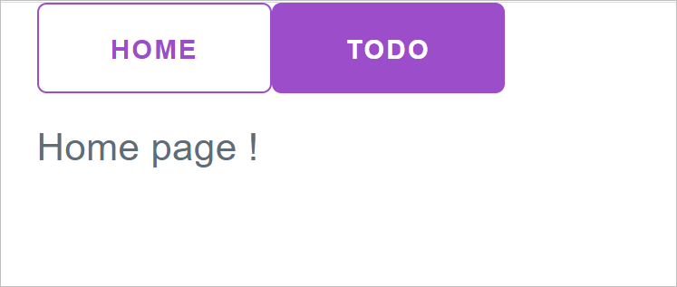
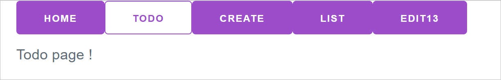

## Router Exercise

In this exercise,all the page FC component you will create will be very simple them.Something like

```
<div>Todo page !</div>;
```

The goal is just tp place some routing in the app between those simple pages.

Use https://reactrouter.com/ as a source of information !

## You can do the exercise with old syntax or new syntax (or both)

This won't change any routed pages code. It will change the first level of routing component in MyApp.js

## setup

        npm install react-router-dom

Also install milligram.css to have nice buttons ...

In App.js add a line at the top

```js
import "./milligram.css";
```

## MyApp Home Todo List Create component

- Code a Home, and (fake) Todo page
- Then in a folder code 2 sub-pages : Create, List and Edit

At this stage each Component is very a basic component like :

```javascript
export function Home(props) {
    return <div>Home page !</div>;
}
```

I propose the following folder structure



##

In a separate HomeMenu component, create menu links to home and todo.

In MyApp code the Routing mechanics. look at https://github.com/remix-run/react-router/tree/dev/examples/basic for
ideas.

Choose URLs

- "/" for Home
- "/todo" for Todo
- ... etc

Use \<Navlink> and use the activeClassName and exact props
https://reactrouter.com/en/6.15.0/components/nav-link

use class="button"
Use class="button-outline" from milligram for a white button

## Style your Link using Milligram



https://milligram.io/buttons.html

And make the button outilined when selected.

on The Todo page links for Home, Todo,



## more on Links

copy the links inside the Routes so that Todo could have a Link

Like :

```javascript
<Routes>
    <Route path="/">
        <div>
            <ul>
                <li>
                    <Link to="/">Home</Link>
                </li>
                <li>
                    <Link to="/todo">Todo</Link>
                </li>
            </ul>
        </div>
        <Home/>
    </Route>
    // ....
</Routes>
```

## test

Test your nav !

## More pages and more links (in the Routes)

On the Todo page as well as Create/List and Edit we need a different menu. Like:


## Add a button on Create to navigate back to List

Use useNavigate for to navigate back :

https://reactrouter.com/en/6.14.2/hooks/use-navigate

## optional className(s)

With &lt;link/> and hook useLocation

https://reactrouter.com/web/api/Hooks/uselocation

https://www.pluralsight.com/guides/applying-classes-conditionally-react

Using backquote template string is the easiest here, sth like:

    <div className={`banner ${active ? "active" : ""}`}>{children}</div>

## design an Edit page which has a path

```jsx
<Route path="/todo/edit/:id">
    <TodoMenu/>
    <Edit/>
</Route>
```

Use a hard coded id value On the Edit page, try to extract the :id from the path using useParams() hook

https://reactrouter.com/en/6.15.0/hooks/use-params
